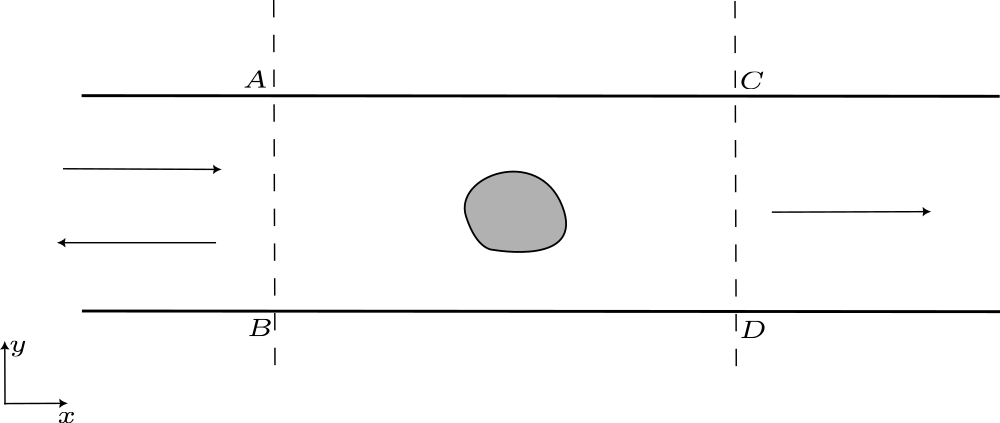
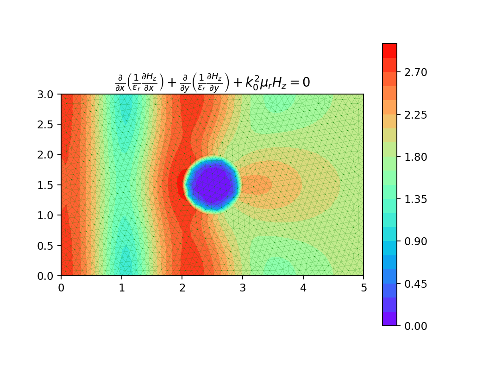
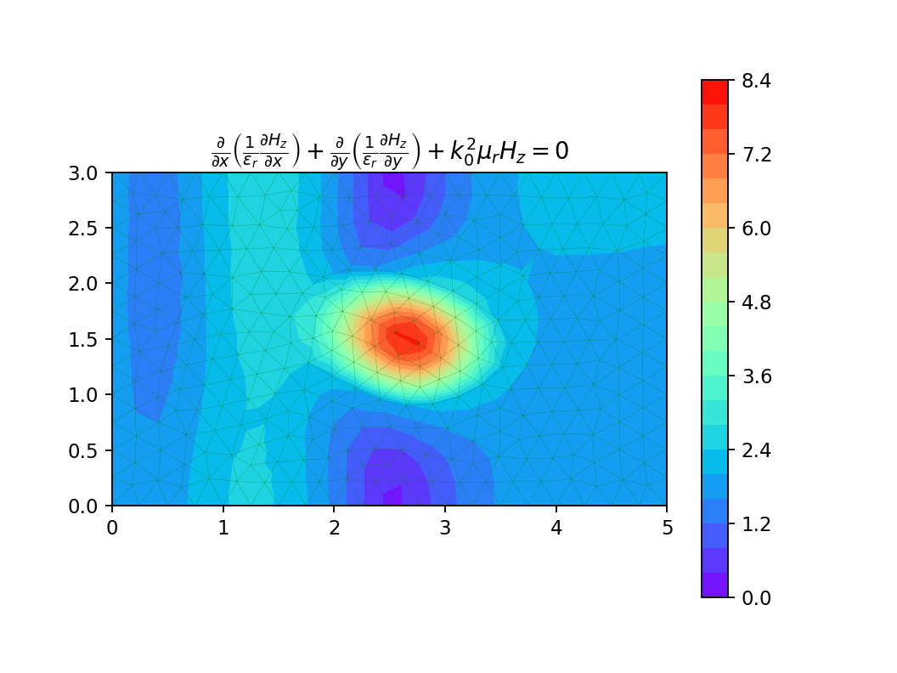
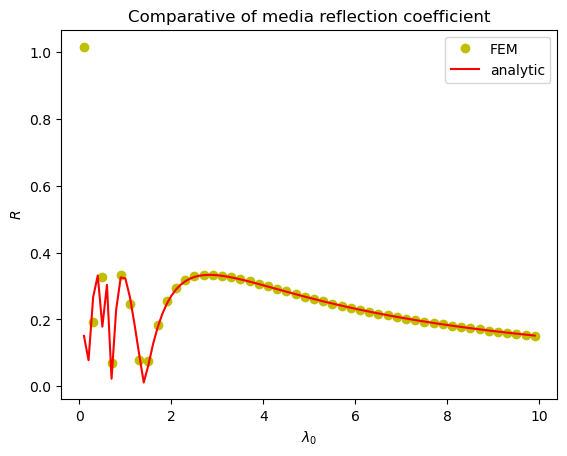

# 平板波导的不均匀性

## 问题描述

平板波导中由于结构或物质的不均匀性，使导波中只有部分入射波功率能穿越不均匀部分而继续沿波导传输，另一部分被反射而沿反方向传输。

    

假设波导工作在只使主模无衰减传输的频段。在离不均匀部分足够远的边界处

$$
\begin{aligned}
    H_z|_{AB}&=H_0e^{-jk_0x}+RH_0e^{jk_0x}\\
    H_z|_{CD}&=TH_0e^{-jk_0x}
\end{aligned}
$$

由于不均匀性激发起了高次模，不均匀部分附近的场只能通过求解微分方程得到

$$
\left\{\begin{aligned}
    &\frac{\partial}{\partial x}\left(\frac{1}{\varepsilon_r}\frac{\partial H_z}{\partial x}\right)+\frac{\partial}{\partial y}\left(\frac{1}{\varepsilon_r}\frac{\partial H_z}{\partial y}\right)+k_0^2\mu_rH_z=0\\
    &\left.\frac{\partial H_z}{\partial n}\right|_{AC,BD}=0\\
    &\left.\frac{\partial H_z}{\partial x}\right|_{AB}\approx jk_0H_z-2jk_0H_0e^{-jk_0x}\\
    &\left.\frac{\partial H_z}{\partial x}\right|_{CD}\approx-jk_0H_z
\end{aligned}\right.
$$

## 求解结果

    
    

反射系数 $R$ 和透射系数 $T$

$$
\begin{aligned}
    R&=\frac{H_z(x_1)-H_0e^{-jk_0x_1}}{H_0e^{jk_0x_1}}\\
    T&=\frac{H_z(x_2)}{H_0e^{-jk_0x_2}}
\end{aligned}
$$

设计了一块介质板，计算其反射系数，与解析解比对

    

