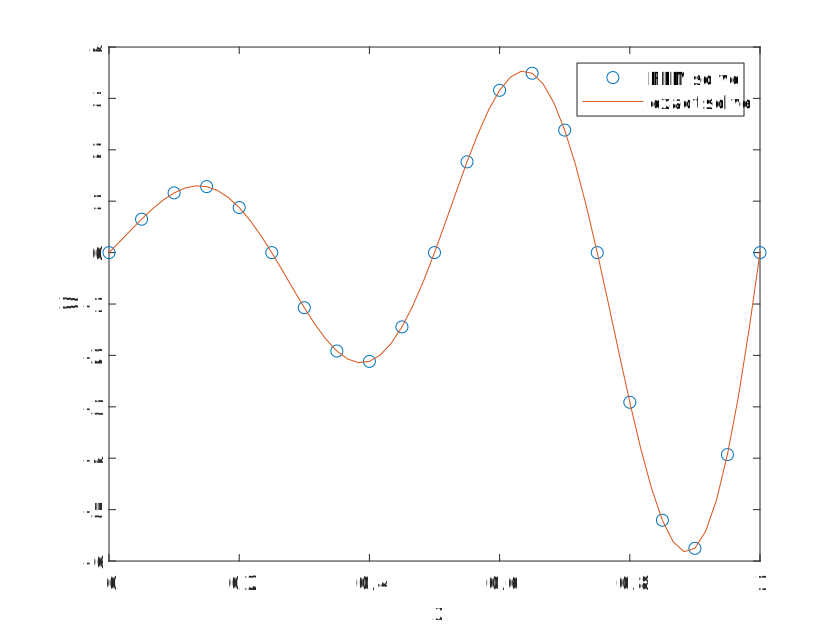

# 一维 Possion 方程求解

[TOC]

$$
\left\{\begin{aligned}
    -\frac{\mathrm{d}^2\varphi}{\mathrm{d}x^2}&=[(16\pi^2-4)\sin(4\pi x)-16\pi\cos(4\pi x)]\exp(2x)\hspace{5ex}x\in(0,1)\\
    \varphi(0)&=0\\
    \varphi(1)&=0
\end{aligned}\right.
$$

其解析解为

$$
\varphi(x)=e^{2x}\sin(4\pi x)
$$

以此为参考，应用有限元方法求解

## 网格划分

因为问题比较简单，故选择均匀直线段作为计算单元

    

## 局域(节点)基函数

$$
\begin{aligned}
    &N_1^e(x)=\frac{x_2^e-x}{x_2^e-x_1^e}\hspace{5ex}N_2^e(x)=\frac{x-x_1^e}{x_2^e-x_1^e}\\
    \Leftrightarrow&\nu_i=\left\{\begin{aligned}
        &\frac{x-x_{i-1}}{x_i-x_{i-1}}\hspace{5ex}x\in[x_{i-1},x_i]\\
        &\frac{x_{i+1}-x}{x_{i+1}-x_i}\hspace{5ex}x\in[x_i,x_{i+1}]\\
        &0\hspace{13ex}\mathrm{otherwise}
    \end{aligned}\right.
\end{aligned}
$$

    

## 刚度矩阵方程

**单元刚度矩阵**

$$
K_{ij}^e=\int_{x_1^e}^{x_2^e}\frac{\mathrm{d}N_i^e}{\mathrm{d}x}\frac{\mathrm{d}N_j^e}{\mathrm{d}x}\mathrm{d}x\Rightarrow\boldsymbol{K}^e=\begin{pmatrix}
    K_{11}^e & K_{12}^e\\
    K_{21}^e & K_{22}^e
\end{pmatrix}
$$

**组合为总刚度矩阵**

$$
\boldsymbol{K}=\sum_{e=1}^M\boldsymbol{K}^e\Rightarrow\boldsymbol{K}=\begin{bmatrix}
    K_{11}^{(1)} &K_{12}^{(1)} & & & &\\
    K_{21}^{(1)} &K_{22}^{(1)}+K_{11}^{(2)} &K_{12}^{(2)} & &\\
    &K_{21}^{(2)} &K_{22}^{(2)}+K_{11}^{(3)} &K_{12}^{(3)} & &\\
    & &K_{21}^{(3)} &K_{22}^{(3)}+K_{11}^{(4)} &K_{12}^{(4)} &\\
    & & &\ddots &\ddots &\\
    & & & &K_{22}^{(M-1)}+K_{11}^{(M)} &K_{12}^{(M)}\\
    & & & &K_{21}^{(M)} &K_{22}^{(M)}
\end{bmatrix}
$$

同理，激励函数对局域基函数加权积分，再进行组合

$$
\begin{aligned}
    &\boldsymbol{b}^e=\begin{bmatrix}
        b_1^e\\
        b_2^e
    \end{bmatrix}\hspace{5ex}b_i^e=\int_{x_1^e}^{x_2^e} N_i^ef\mathrm{d}x\\
    \Rightarrow&\boldsymbol{b}=\begin{bmatrix}
        b_1^{(1)}\\
        b_2^{(1)}+b_1^{(2)}\\
        b_2^{(2)}+b_1^{(3)}\\
        b_2^{(3)}+b_1^{(4)}\\
        \vdots\\
        b_2^{(M-1)}+b_1^{(M)}\\
        b_2^{(M)}
    \end{bmatrix}
\end{aligned}
$$

最后得到有限元方程组

$$
\boldsymbol{K}\boldsymbol{\varphi}=\boldsymbol{b}
$$

## Dirichlet 边界条件

简单考虑 Dirichlet 边界条件 $\varphi|_{x=0}=p$，为了保持刚度矩阵的对称性，将方程处理为

$$
\begin{bmatrix}
    1 &0 &0 &\cdots &0\\
    0 &K_{22} &K_{23} &\dots &K_{2N}\\
    0 &K_{32} &K_{33} &\dots &K_{3N}\\
    \vdots &\vdots  &\vdots &\ddots &\vdots\\
    0 &K_{N2}  &K_{N3} &\cdots &K_{NN}
\end{bmatrix}\begin{bmatrix}
    \varphi_1\\
    \varphi_2\\
    \varphi_3\\
    \vdots\\
    \varphi_N
\end{bmatrix}=\begin{bmatrix}
    p\\
    b_2-K_{21}p\\
    b_3-K_{31}p\\
    \vdots\\
    b_N-K_{N1}p
\end{bmatrix}
$$

## 方程求解

*较简单的方程组可以采用 Gauss 消元方法（矩阵分解方法）求解，比较复杂的有限元方程应用迭代方法求解。一般的有限元刚度矩阵为对称矩阵，故采用对角线存储方式，求解过程稍许变化。*

应用 MATLAB 写了一个简单的例子:chestnut:（划分了 $20$ 个计算单元）

    

