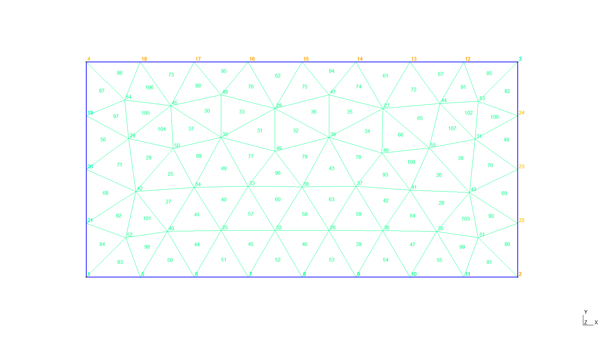
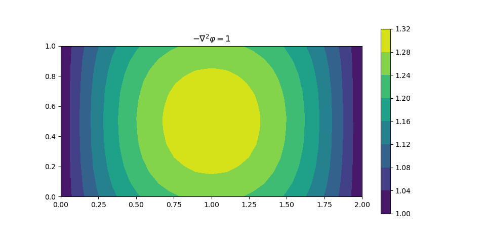

# 二维有限元分析

[TOC]

## 边值问题

考虑一个一般的二维边值问题

$$
\left\{\begin{aligned}
    &-\frac{\partial}{\partial x}\left(\alpha_x\frac{\partial\varphi}{\partial x}\right)-\frac{\partial}{\partial y}\left(\alpha_y\frac{\partial\varphi}{\partial y}\right)+\beta\varphi=f\hspace{3ex}(x,y)\in\Omega\\
    &\varphi|_{\Gamma_1}=p\\
    &\left[\left(\alpha_x\frac{\partial\varphi}{\partial x}\hat{x}+\alpha_y\frac{\partial\varphi}{\partial y}\hat{y}\right)\cdot\hat{n}+\gamma\varphi\right]_{\Gamma_2}=q
\end{aligned}\right.
$$

其等价变分问题为

$$
\begin{aligned}
    &\begin{cases}
        \delta F(\varphi)=0\\
        \varphi|_{\Gamma_1}=p
    \end{cases}\\
    F(\varphi)=&\frac{1}{2}\iint_\Omega\left[\alpha_x\left(\frac{\partial\varphi}{\partial x}\right)^2+\alpha_y\left(\frac{\partial \varphi}{\partial y}\right)^2+\beta\varphi^2\right]\mathrm{d}\Omega\\
    &+\int_{\Gamma_2}\left(\frac{\gamma}{2}\varphi^2-q\varphi\right)\mathrm{d}\Gamma-\iint_\Omega f\varphi\mathrm{d}\Omega
\end{aligned}
$$

## 区域离散

    

需要一个 $3\times M$ 的整数型数组 $n(i,e)$ 来存储三个节点组成的三角形单元

| $e$ | $n(1, e)$ | $n(2, e)$ | $n(3, e)$ |
| :--: | :--: | :--: | :--: |
| $1$ | $\times$ | $\times$ | $\times$ |
| $2$ | $\times$ | $\times$ | $\times$ |
| $3$ | $\times$ | $\times$ | $\times$ |
| $\vdots$ | $\vdots$ | $\vdots$ | $\vdots$ |
| $M$ | $\times$ | $\times$ | $\times$ |

在数组 $n(i,e)$ 中，$i=1,2,3$ 是节点局部编码，$e=1,2,3,\cdots,M$ 是单元编码。因此，数组 $n(i,e)$ 描述了单元和节点编码的拓扑关系（全局节点编码、局部节点编码和单元编码）。

## 局域基函数

对于线性三角形单元

$$
\varphi^e(x,y)=a^e+b^ex+c^ey=\sum_{j=1}^3N_j^e(x,y)\varphi_j^e
$$

其中，插值基函数 $N_j^e(x,y)=\delta_{ij}$

$$
N_j^e(x,y)=\frac{1}{2\Delta^e}(a_j^e+b_j^ex+c_j^ey)
$$

$$
\begin{aligned}
    &a_1^e=x_2^ey_3^e-y_2^ex_3^e\hspace{5ex} &b_1^e=y_2^e-y_3^e\hspace{5ex} &c_1^e=x_3^e-x_2^e\\
    &a_2^e=x_3^ey_1^e-y_3^ex_1^e\hspace{5ex} &b_2^e=y_3^e-y_1^e\hspace{5ex} &c_2^e=x_1^e-x_3^e\\
    &a_3^e=x_1^ey_2^e-y_1^ex_2^e\hspace{5ex} &b_3^e=y_1^e-y_2^e\hspace{5ex} &c_3^e=x_2^e-x_1^e
\end{aligned}
$$

$$
\Delta^e=\frac{1}{2}\begin{vmatrix}
    1 &x_1^e &y_1^e\\
    1 &x_2^e &y_2^e\\
    1 &x_3^e &y_3^e
\end{vmatrix}=\frac{1}{2}(b_1^ec_2^e-b_2^ec_1^e)
$$

$\Delta^e$ 为第 $e$ 个三角形单元面积，插值基函数（形状函数 $N_j^e$）的选择性使得一个单元边的 $\varphi^e$ 值与其相对节点处的 $\varphi$ 值无关，而是由该边两端点处的 $\varphi$ 值确定。

## 刚度矩阵

在不考虑 Neumann 边界条件的情形下

$$
F^e=\frac{1}{2}\iint_\Omega\left[\alpha_x\left(\frac{\partial\varphi}{\partial x}\right)^2+\alpha_y\left(\frac{\partial \varphi}{\partial y}\right)^2+\beta\varphi^2\right]\mathrm{d}\Omega-\iint_\Omega f\varphi\mathrm{d}\Omega
$$

对单元泛函 $F^e(\varphi^e)$ 求极值得到刚度矩阵的方程

$$
\begin{aligned}
    \frac{\partial F^e}{\partial \boldsymbol{\varphi}^e}&=\boldsymbol{K}^e\boldsymbol{\varphi}^e-\boldsymbol{b}^e=\boldsymbol{0}\\
    K_{ij}^e&=\iint_{\Omega^e}\left(\alpha_x\frac{\partial N_i^e}{\partial x}\frac{\partial N_j^e}{\partial x}+\alpha_y\frac{\partial N_i^e}{\partial y}\frac{\partial N_j^e}{\partial y}+\beta N_i^eN_j^e\right)\mathrm{d}x\mathrm{d}y\\
    &\approx\frac{1}{4\Delta^e}(\alpha_x^eb_i^eb_j^e+\alpha_y^ec_i^ec_j^e)+\frac{\Delta^e}{12}\beta^e(1+\delta_{ij})\\
    b_i^e&=\iint_{\Omega^e}fN_i^e\mathrm{d}x\mathrm{d}y\approx\frac{\Delta^e}{3}f^e
\end{aligned}
$$

对 $M$ 个计算单元的刚度矩阵方程进行组合得到总刚度矩阵方程

$$
\begin{aligned}
    \sum_{e=1}^M\frac{\partial F^e}{\partial \varphi^e}&=\sum_{e=1}^M\left(\boldsymbol{K}^e\boldsymbol{\varphi}^e-\boldsymbol{b}^e\right)\\
    &=\boldsymbol{K}\boldsymbol{\varphi}-\boldsymbol{b}=\boldsymbol{0}
\end{aligned}
$$

## 边界条件处理

### Neumann 边界条件

考虑非齐次的 Neumann 边界条件（自然边界条件）的情形，则需要在泛函中附加 $F_b(\varphi)$

$$
F_b(\varphi)=\int_{\Gamma_2}\left(\frac{\gamma}{2}\varphi^2-q\varphi\right)\mathrm{d}\Gamma
$$

将 $\Gamma_2$ 离散为 $N_s$ 个线段单元，同一维有限元问题类似，对边界单元求泛函极值，得到附加的单元刚度矩阵方程

$$
\begin{aligned}
    \frac{\partial F_b^s}{\partial \boldsymbol{\varphi}^s}&=\boldsymbol{K}^s\boldsymbol{\varphi}^s-\boldsymbol{b}^s=\boldsymbol{0}\\
    K_{ij}^s&=\int_0^1\gamma N_i^sN_j^sl^s\mathrm{d}\zeta\approx\gamma^s\frac{l^s}{6}(1+\delta_{ij})\\
    b_i^s&=\int_0^1qN_i^sl^s\mathrm{d}\zeta\approx q^s\frac{l^s}{2}
\end{aligned}
$$

其中，$\zeta$ 为线段单元节点 $1$ 到节点 $2$ 的归一化距离，$l^s$ 表示线段单元的长度。为了能实现附加的刚度矩阵方程组合到总刚度矩阵方程，需要一个 $2\times N_s$ 的联系数组 $ns(i,s)$ 来给出线段单元节点的局部编码与全局编码的映射关系

| $s$ | $ns(1,s)$ | $ns(2,s)$ |
| :--: | :--: | :--: |
| $1$ | $\times$ | $\times$ |
| $2$ | $\times$ | $\times$ |
| $\vdots$ | $\vdots$ | $\vdots$ |
| $N_s$ | $\times$ | $\times$ |

### Dirichlet 边界条件

#### 第一种处理方法

* $b_{nd(i)}=p(i)$，$K_{nd(i),nd(i)}=1$，$K_{nd(i),j}=0\hspace{5ex}j\neq nd(i)$
* $b_j\leftarrow b_j-K_{j,nd(i)}p(i)$，$K_{i,nd(i)}=0\hspace{5ex}j\neq nd(i)$

#### 第二种处理方法

* $K_{nd(i),nd(i)}=10^{70}$，$b_{nd(i)}=p(i)\times10^{70}$

## 算例

$$
\left\{\begin{aligned}
    &-\nabla^2\varphi=1 &&x\in[0, 2],y\in[0,1]\\
    &\varphi=1 &&x=0,2\\
    &\frac{\partial\varphi}{\partial n}+\varphi=1 &&y=0,1
\end{aligned}\right.
$$

对 Poisson 方程进行求解，有限元方法计算结果

    

