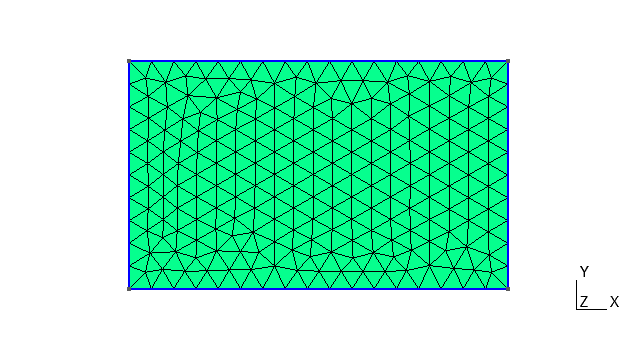
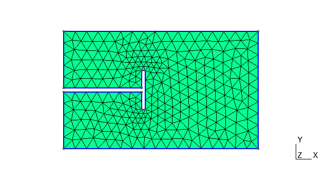
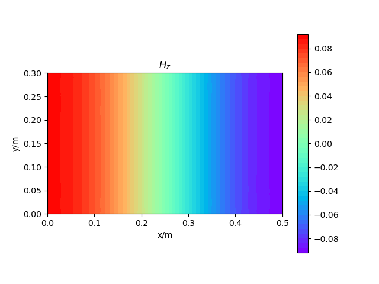
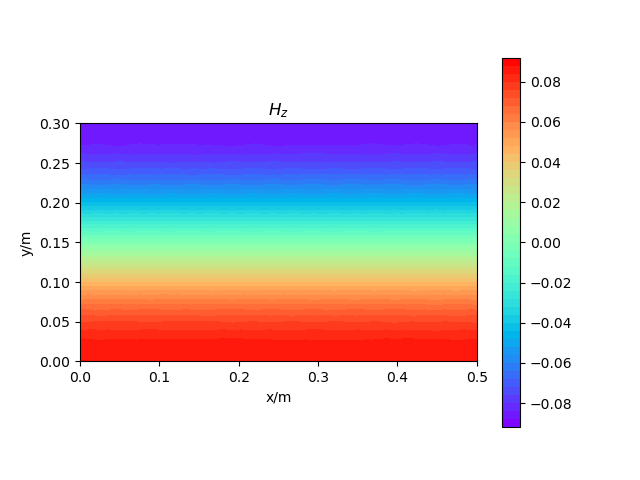
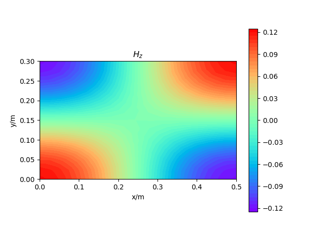
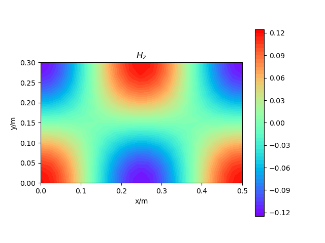
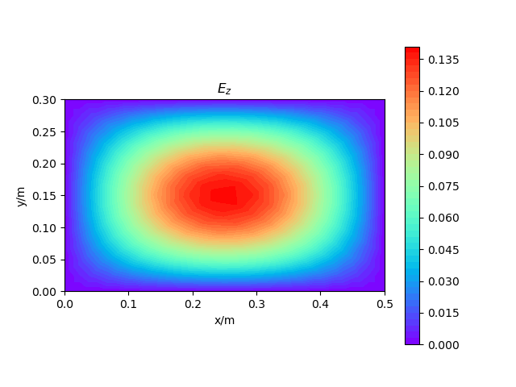
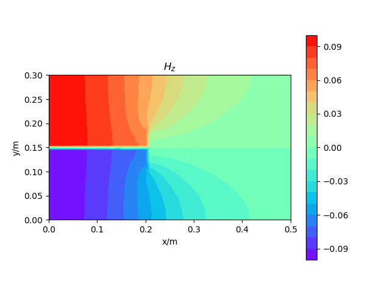
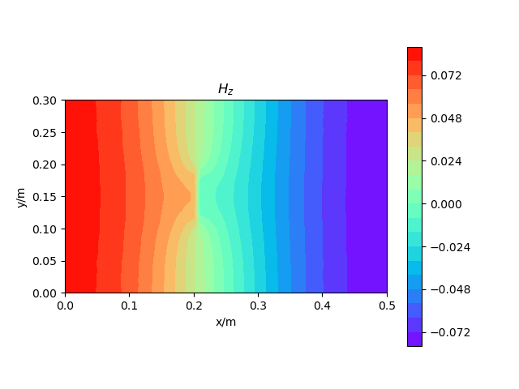

# T隔膜波导模式问题

[TOC]

## 广义本征值问题

在均匀波导中，存在两套不同的模式，TM模（在传播方向上没有磁场分量）和TE模（在传播方向上没有电场分量）。TM模和TE模的支配场量都满足齐次 Helmholtz 方程

$$
\frac{\partial^2\varphi}{\partial x^2}+\frac{\partial^2\varphi}{\partial y^2}+(\omega^2\varepsilon\mu-k_z^2)\varphi=0
$$

对于 TM 情形，支配场量 $E_z$ 在波导壁上满足齐次 Dirichlet 边界条件

$$
\varphi=0
$$

对于 TE 情形，支配场量 $H_z$ 在波导壁上满足齐次 Neumann 边界条件

$$
\frac{\partial \varphi}{\partial n}=0
$$

应用有限元方法求解本征值问题

$$
\begin{aligned}
    \boldsymbol{A}\varphi&=k_t^2\boldsymbol{B}\varphi\\
    A_{ij}^e&=\int_{\Omega^e}\left(\frac{\partial N_i^e}{\partial x}\frac{\partial N_j^e}{\partial x}+\frac{\partial N_i^e}{\partial y}\frac{\partial N_j}{\partial y}\right)\mathrm{d}\Omega\approx\frac{1}{4\Delta^e}(b_i^eb_j^e+c_i^ec_j^e)\\
    B_{ij}^e&=\int_{\Omega^e}N_i^eN_j^e\mathrm{d}\Omega\approx\frac{\Delta^e}{12}(1+\delta_{ij})
\end{aligned}
$$

## 有限元求解

几何建模与网格离散

    
    

### 矩形空波导

    
    

    
    

    
    

### 加入 T 隔膜

    
    

