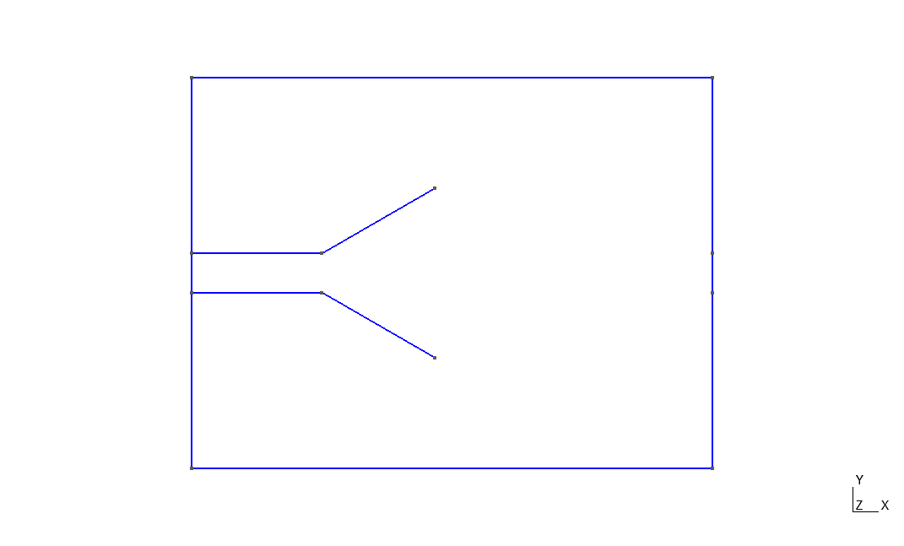
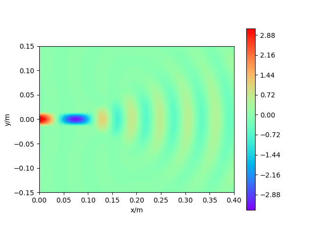
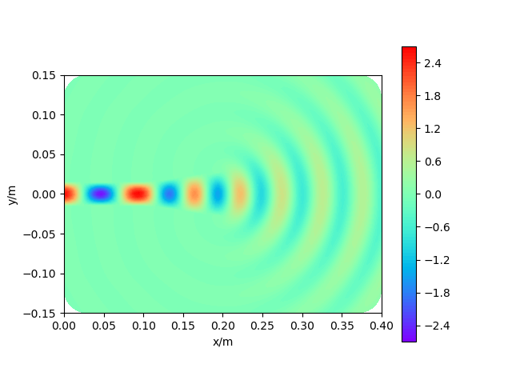
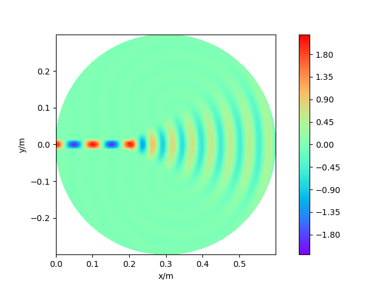

# 喇叭天线辐射问题

[TOC]

## 边值问题

    

求解 TE 模式电磁波，即求解 Helmholtz 方程

$$
\frac{\partial}{\partial x}\left(\frac{1}{\mu_r}\frac{\partial E_x}{\partial x}\right)+\frac{\partial}{\partial y}\left(\frac{1}{\mu_r}\frac{\partial E_y}{\partial y}\right)+k_0^2\varepsilon_rE_z=0
$$

喇叭天线采用平板波导馈电，在波导截断边界处应用 Robin 边界条件

$$
\begin{aligned}
    \frac{\partial E_z}{\partial x}&=-jk_xE_0e^{-jk_xx}+jk_xRE_0e^{jk_xx}\\
    &=jk_xE_z-2jk_xE_z^{in}
\end{aligned}
$$

在其他截断边界处应用 Sommerfeld 辐射条件

$$
\begin{aligned}
    &\frac{\partial E_z}{\partial n}+\left[jk_0+\frac{\kappa(s)}{2}\right]E_z=0 &\mathrm{1order}\\
    &\frac{\partial E_z}{\partial n}+\left[jk_0+\frac{\kappa}{2}-\frac{j\kappa^2}{8(j\kappa-k_0)}\right]E_z-\frac{j}{2(j\kappa-k_0)}\frac{\partial^2E_z}{\partial s^2}=0 &\mathrm{2order}
\end{aligned}
$$

## 有限元求解结果

    
    

    

