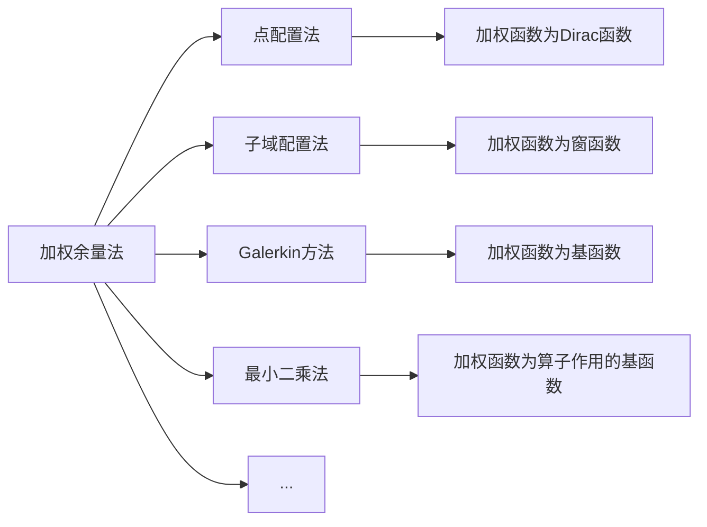

# 有限元方法基本原理

[TOC]

对于微分方程

$$
\mathcal{L}\varphi=f
$$

可以尝试用一组基函数对精确解 $\varphi$ 进行近似

$$
\widetilde{\varphi}=\sum_{j=1}^Nc_j\nu_j
$$

那么，微分方程的求解过程就是确定展开系数 $c_j$ 的过程。

## Ritz 变分法

如果微分算子 $\mathcal{L}$ 是自伴算子，并且是正定算子

$$
\begin{aligned}
    (\mathcal{L}\varphi,\psi)&=(\varphi, \mathcal{L}\psi)=\int_{\Omega}\varphi\mathcal{L}\psi\mathrm{d}\Omega\\
    (\mathcal{L}\varphi,\varphi)&\begin{cases}
        >0\hspace{5ex}\varphi\neq0\\
        =0\hspace{5ex}\varphi=0
    \end{cases}
\end{aligned}
$$

那么，微分方程就能与之对应的泛函极值问题（变分问题）等价:smirk:

$$
\begin{aligned}
    \mathcal{L}\varphi&=f\Leftrightarrow\delta F=0\\
    F(\widetilde{\varphi})&=\frac{1}{2}(\mathcal{L}\widetilde{\varphi},\widetilde{\varphi})-\frac{1}{2}(\widetilde{\varphi},f)-\frac{1}{2}(f,\widetilde{\varphi})
\end{aligned}
$$

由泛函极值问题可以得到一组线性方程组

$$
\begin{aligned}
    \frac{\partial F}{\partial c_i}&=\frac{1}{2}(\mathcal{L}\nu_i,\widetilde{\varphi})+\frac{1}{2}(\mathcal{L}\widetilde{\varphi},\nu_i)-(\nu_i,f)\\
    &=\frac{1}{2}\sum_{j=1}^Nc_j\left[(\mathcal{L}\nu_i,\nu_j)+(\mathcal{L}\nu_j,\nu_i)\right]-(\nu_i,f)\\
    &=0
\end{aligned}
$$

因此，应用 Ritz 变分法可将微分方程问题转换为求解解矩阵方程

$$
\begin{aligned}
    \boldsymbol{S}\mathit{c}&=\mathit{b}\\
    S_{ij}&=(\mathcal{L}\nu_i,\nu_j)\hspace{5ex}b_i=(\nu_i,f)
\end{aligned}
$$

其中，$\boldsymbol{S}$ 为刚度矩阵。

## Galerkin 加权余量法

对于微分方程的近似解 $\widetilde{\varphi}$，其余量并不为零

$$
r=\mathcal{L}\widetilde{\varphi}-f\neq0
$$

但是，可以通过加权余量的方式得到更精确的近似解

$$
R_i=\int_{\Omega}w_ir\mathrm{d}\Omega=0
$$

实际中常用 Galerkin 方法，即加权函数 $w_i$ 为基函数 $\nu_i$:pencil2:

$$
R_i=(\nu_i,\mathcal{L}\widetilde{\varphi}-f)=0
$$

*可以发现，当微分算子 $\mathcal{L}$ 为自伴算子时，Ritz 变分法与 Galerkin 加权余量法的线性方程组相同。*

## 有限元方法（局域基函数求解）

在整个求解域内找到适合边值问题（或初值问题）的基函数是相当困难的，那么可以将求解区域划分为有限个计算单元，**并在每个计算单元内定义局域基函数**。单元区域较小，所以在每个计算单元内，函数 $\varphi$ 的变化不大，因此**局域基函数**可以选用较简单的插值函数（Lagrange 基函数或者 Hermite 基函数）:dog:

因此，有限元分析包含步骤有

* 区域的离散或单元划分
* 插值函数的选择
* 方程组的建立
* 方程组的求解

-----

**区域离散** 就是将求解域 $\Omega$ 划分为 $m$ 个计算单元 $\Omega^i$（$i=1,2,3,\cdots,m$）

* 一维区域：直线段
* 二维区域：三角形、矩形
* 三维区域：四面体、三棱柱、矩形块...

-----

**插值函数的选择**

标量有限元的基函数与单元节点有关，因此需要根据具体问题在计算单元内定义一些节点，完整描述一个节点需要

* 坐标：位置坐标、面积（体积）坐标
* 局部编码：表示节点在单元中的位置
* 全局编码：表示节点在整个系统中的位置

可以用插值函数作为局域基函数来近似一个计算单元 $\Omega^e$ 内的解函数 $\varphi^e$

$$
\widetilde{\varphi}^e=\sum_{j=1}^nN_j^e\varphi_j^e=\boldsymbol{N}^{e\mathrm{T}}\boldsymbol{\varphi}^e
$$

其中，$n$ 为单元中的节点数，$\varphi_j^e$ 为节点 $j$ 处的 $\varphi$ 值，$N_j^e$ 为插值基函数。

-----

### Ritz 有限元方法

**在每个计算单元 $\Omega^e$ 内，单元泛函 $F_e(\widetilde{\varphi}^e)$**（采用局部编码）

$$
\begin{aligned}
    F^e(\widetilde{\varphi}^e)&=\frac{1}{2}\int_{\Omega^e}\widetilde{\varphi}^e\mathcal{L}\widetilde{\varphi}^e\mathrm{d}\Omega-\int_{\Omega^e}f\widetilde{\varphi}^e\mathrm{d}\Omega\\
    &=\frac{1}{2}\boldsymbol{\varphi}^{e\mathrm{T}}\int_{\Omega^e}\boldsymbol{N}^e\mathcal{L}\boldsymbol{N}^{e\mathrm{T}}\mathrm{d}\Omega\boldsymbol{\varphi}^e-\boldsymbol{\varphi}^{r\mathrm{T}}\int_{\Omega^e}f\boldsymbol{N}^e\mathrm{d}\Omega\\
    &=\frac{1}{2}\boldsymbol{\varphi}^{e\mathrm{T}}\boldsymbol{K}^e\boldsymbol{\varphi}^e-\boldsymbol{\varphi}^{e\mathrm{T}}\boldsymbol{b}^e
\end{aligned}
$$

**考虑整个计算域 $\Omega$ 上的泛函 $F(\widetilde{\varphi})$ 就是对单元泛函进行组合的过程**（采用全局编码）

$$
\begin{aligned}
    F(\widetilde{\varphi})&=\sum_{e=1}^m\left(\frac{1}{2}\boldsymbol{\varphi}^{e\mathrm{T}}\boldsymbol{K}^e\boldsymbol{\varphi}^e-\boldsymbol{\varphi}^{e\mathrm{T}}\boldsymbol{b}^e\right)\\
    &=\frac{1}{2}\boldsymbol{\varphi}^{\mathrm{T}}\boldsymbol{K}\boldsymbol{\varphi}-\boldsymbol{\varphi}^{\mathrm{T}}\boldsymbol{b}
\end{aligned}
$$

*注意：$\boldsymbol{K}^e$ 为 $n\times n$ 的单元刚度矩阵，$\boldsymbol{K}$ 为 $N\times N$ 的总刚度矩阵（$N$ 为节点总数）。* 

**根据 Ritz 变分原理得到有限元方程组:maple_leaf:**

$$
\begin{aligned}
    \frac{\partial F}{\partial \varphi_i}&=\frac{1}{2}\sum_{j=1}^N(K_{ij}+K_{ji})\varphi_j-b_i=0\\
    \Leftrightarrow\boldsymbol{K}\boldsymbol{\varphi}&=\boldsymbol{b}
\end{aligned}
$$

### Galerkin 有限元方法

类似的操作过程，**在每个计算单元内考虑加权余量 $R_i^e$**（采用局部编码）

$$
\begin{aligned}
    R_i^e&=\int_{\Omega^e}N_i^e(\mathcal{L}\widetilde{\varphi}^e-f)\mathrm{d}\Omega\\
    &=\int_{\Omega^e}N_i^e\mathcal{L}\boldsymbol{N}^{e\mathrm{T}}\mathrm{d}\Omega\boldsymbol{\varphi}^e-\int_{\Omega^e}fN_i^e\mathrm{d}\Omega\\
    \Leftrightarrow\boldsymbol{R}^e&=\boldsymbol{K}^e\boldsymbol{\varphi}^e-\boldsymbol{b}^e
\end{aligned}
$$

**考虑整个计算域 $\Omega$ 上的加权余量 $\boldsymbol{R}$，就需要先对计算单元上的加权余量 $\boldsymbol{R}^e$ 进行扩展，再对扩展了的加权余量 $\bar{\boldsymbol{R}}^e$ 进行组合（采用全局编码）**

$$
\boldsymbol{R}=\sum_{e=1}^m\bar{\boldsymbol{R}}^e=\sum_{e=1}^m\left(\bar{\boldsymbol{K}}^e\bar{\boldsymbol{\varphi}}^e-\bar{\boldsymbol{b}}^e\right)
$$

*注意：$\boldsymbol{K}^e$ 为 $n\times n$ 的单元刚度矩阵，$\bar{\boldsymbol{K}}^e$ 为 $N\times N$ 的扩展后的单元刚度矩阵。因为与某一节点 $i$ 有关的加权函数（插值基函数）遍及与该节点直接相连的单元，那么与节点 $i$ 有关的加权余量 $R_i$ 就是对所有直接和节点 $i$ 相连的单元的求和，因此需要对单元上的加权余量 $R^e$ 进行扩展。*

**加权余量 $\bar{\boldsymbol{R}}^e$ 组合后便可以得到有限元方程组:hibiscus:**

$$
\sum_{e=1}^m\left(\bar{\boldsymbol{K}}^e\bar{\boldsymbol{\varphi}}^e-\bar{\boldsymbol{b}}^e\right)=\boldsymbol{0}
$$

-----

**方程组的求解**

由非齐次微分方程或非齐次边界条件导出的 **确定型方程组**（散射、辐射、存在源或激励的问题）

$$
\boldsymbol{A}\boldsymbol{x}=\boldsymbol{b}
$$

由齐次控制微分方程和其次边界条件导出的 **本征值型方程组**（无源问题）

$$
\boldsymbol{A}\boldsymbol{x}=\lambda\boldsymbol{B}\boldsymbol{x}
$$
