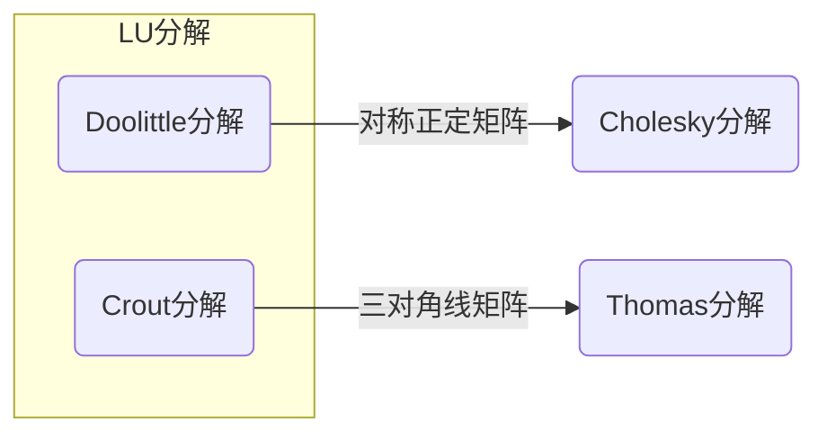

# 矩阵三角分解

[TOC]

-----

## LU 分解

*从矩阵分解的角度看 Gauss 消元法可以发现，Gauss 消元法的实质是将系数矩阵 $\boldsymbol{A}$ 分解为两个三角形矩阵相乘*:smile:

**矩阵的 LU 分解定理 —— 若 $\boldsymbol{A}$ 为 $n$ 阶矩阵，如果 $\boldsymbol{A}$ 的顺序主子式 $D_i\neq0$，则 $\boldsymbol{A}$ 可分解为一个单位下三角矩阵 $\boldsymbol{L}$ 和一个上三角矩阵 $\boldsymbol{U}$ 的乘积，且这种分解是唯一的。**

一旦实现了矩阵 $\boldsymbol{A}$ 的 LU 分解，那么求解 $\boldsymbol{A}x=b$ 的问题就等价于求解两个三角形的方程组

$$
\boldsymbol{A}x=b\Leftrightarrow\begin{cases}
    \boldsymbol{L}y=b\\
    \boldsymbol{U}x=y
\end{cases}
$$

### Doolittle 分解

$\boldsymbol{A}=\boldsymbol{LU}$，其中，$L$ 为单位下三角矩阵，$U$ 为上三角矩阵

$$
\boldsymbol{A}=\begin{pmatrix}
    1 & & &\\
    l_{21} & 1 & &\\
    \vdots & \vdots & \ddots &\\
    l_{n1} & l_{n2} & \dots &1
\end{pmatrix}\begin{pmatrix}
    u_{11} & u_{12} & \dots & u_{1n}\\
    & u_{22} & \dots & u_{2n}\\
    & & \ddots & \vdots\\
    & & & u_{nn}
\end{pmatrix}
$$

可根据矩阵 $\boldsymbol{A}$ 确定矩阵 $\boldsymbol{L}$ 和 $\boldsymbol{U}$ 的元素

$$
\begin{aligned}
    a_{ri}&=\sum_{k=1}^nl_{rk}u_{ki}=\sum_{k=1}^{r-1}l_{rk}u_{ki}+u_{ri}\Rightarrow确定\boldsymbol{U}的第r行元素\\
    a_{ir}&=\sum_{k=1}^{n}l_{ik}u_{kr}=\sum_{k=1}^{r-1}l_{ik}u_{kr}+l_{ir}u_{rr}\Rightarrow确定\boldsymbol{L}的第r列元素
\end{aligned}
$$

因此，**Doolittle 分解方法** 求解线性方程组步骤

* Doolittle 分解
  * $u_{1i}=a_{1i}$，$l_{i1}=a_{i1}/u_{11}$
  * 计算 $\boldsymbol{U}$ 的第 $r$ 行，$\boldsymbol{L}$ 的第 $r$ 列元素
    * $u_{ri}=a_{ri}-\sum_{k=1}^{r-1}l_{rk}u_{ki}\hspace{5ex}i=r,r+1,\cdots,n$
    * $l_{ir}=(a_{ir}-\sum_{k=1}^{r-1}l_{ik}u_{kr})/u_{rr}\hspace{5ex}i=r+1,r+2,\cdots,n$
* 求解 $\boldsymbol{L}y=b$，$\boldsymbol{U}x=y$
  * $y_1=b_1$，$y_i=b_i-\sum_{k=1}^{i-1}l_{ik}y_k$
  * $x_n=y_n/u_{nn}$，$x_i=(y_i-\sum_{k=i+1}^{n}u_{ik}x_k)/u_{ii}$

### Crout 分解

$\boldsymbol{A}=\boldsymbol{LU}$，其中，$\boldsymbol{L}$ 为下三角矩阵，$\boldsymbol{U}$为单位上三角矩阵

$$
\boldsymbol{A}=\begin{pmatrix}
    l_{11} & & &\\
    l_{21} & l_{21} & &\\
    \vdots & \vdots & \ddots &\\
    l_{n1} & l_{n2} & \dots &l_{nn}
\end{pmatrix}\begin{pmatrix}
    1 & u_{12} & \dots & u_{1n}\\
    & 1 & \dots & u_{2n}\\
    & & \ddots & \vdots\\
    & & & 1
\end{pmatrix}
$$

可同 Doolittle 分解一样确定矩阵 $\boldsymbol{L}$ 和 $\boldsymbol{U}$，Crout 分解的计算公式为

$$
\begin{aligned}
    l_{i1}&=a_{i1}\hspace{5ex}u_{1j}=a_{1j}/l_{11}\\
    l_{ik}&=a_{ik}-\sum_{s=1}^{k-1}l_{is}u_{sk} &i\geq k\\
    u_{kj}&=\frac{a_{kj}-\sum_{s=1}^{k-1}l_{ks}u_{sj}}{l_{kk}} &k<j
\end{aligned}
$$

**Crout 分解方法** 的计算流程与 Doolittle 分解方法相同

* Crout 分解
  * $l_{i1}=a_{i1}$，$u_{1j}=a_{1j}/l_{11}$
  * 计算 $\boldsymbol{L}$ 的第 $k$ 列，$\boldsymbol{U}$ 的第 $k$ 行元素
    * $l_{ik}=a_{ik}-\sum_{s=1}^{k-1}l_{is}u_{sk}\hspace{5ex}i=k,k+1,\cdots,n$
    * $u_{kj}=(a_{kj}-\sum_{s=1}^{k-1}l_{ks}u_{sj})/l_{kk}\hspace{5ex}j=k+1,k+2,\cdots,n$
* 求解 $\boldsymbol{L}y=b$，$\boldsymbol{U}x=y$
  * $y_1=b_1/l_{11}$，$y_{i}=(b_i-\sum_{k=1}^{i-1}l_{ik}y_k)/l_{ii}$
  * $x_n=y_n$，$x_i=y_i-\sum_{k=i+1}^nu_{ik}x_k$

-----

## Cholesky 分解

*应用有限元法解结构力学问题时，最后归结为求解线性方程组，系数矩阵大多具有对称正定性质*:smile:

**Cholesky 分解定理 —— 如果 $\boldsymbol{A}$ 为 $n$ 阶对称正定矩阵，则存在一个实的非奇异下三角矩阵 $\boldsymbol{L}$ 使 $\boldsymbol{A}=\boldsymbol{L}\boldsymbol{L}^\mathrm{T}$，当限定 $\boldsymbol{L}$ 的对角元素为正时，这种分解是唯一的。**

$$
\boldsymbol{A}=\begin{pmatrix}
    l_{11} & & & \\
    l_{21} & l_{22} & & \\
    \vdots & \vdots & \ddots &\\
    l_{n1} & l_{n2} & \dots & l_{nn}
\end{pmatrix}\begin{pmatrix}
    l_{11} & l_{21} & \dots & l_{n1}\\
    & l_{22} & \dots & l_{n2}\\
    & & \ddots & \vdots\\
    & & & l_{nn}
\end{pmatrix}
$$

可根据 $\boldsymbol{A}$ 矩阵元素确定 $\boldsymbol{L}$ 矩阵元素

$$
a_{ij}=\sum_{k=1}^nl_{ik}l_{jk}=\sum_{k=1}^{j-1}l_{ik}l_{jk}+l_{jj}l_{ij}\Rightarrow确定\boldsymbol{L}的第j列元素
$$

因此，**Cholesky 分解方法**求解线性方程组步骤为

* Cholesky 分解（逐次计算 $\boldsymbol{L}$ 第 $j$ 列元素）
  * $l_{jj}=(a_{jj}-\sum_{k=1}^{j-1}l_{jk}^2)^{1/2}$
  * $l_{ij}=(a_{jj}-\sum_{k=1}^{j-1}l_{ik}l_{jk})/l_{jj}$
* 求解两个三角形方程组
  * $y_i=(b_i-\sum_{k=1}^{i-1}l_{ik}y_k)/l_{ii}$
  * $x_i=(b_i-\sum_{k=i+1}^{n}l_{ki}x_k)/l_{ii}$

### 改进 Cholesky 分解方法

在应用 Cholesky 分解方法求解线性组时，$\boldsymbol{L}$ 矩阵对角线元素 $l_{kk}$ 的计算需要用到开方运算。为了避免开方，对 Cholesky 分解方法进行改进。

**对称阵的三角分解定理 —— 对于 $n$ 阶对称矩阵 $\boldsymbol{A}$，且 $\boldsymbol{A}$ 的所有顺序主子式均不为零，那么 $\boldsymbol{A}$ 可唯一分解为 $\boldsymbol{A}=\boldsymbol{L}\boldsymbol{D}\boldsymbol{L}^{\mathrm{T}}$，其中 $\boldsymbol{L}$ 为单位下三角矩阵，$\boldsymbol{D}$ 为对角矩阵。**

$$
\boldsymbol{A}=\begin{pmatrix}
    1 & & &\\
    l_{21} & 1 & &\\
    \vdots & \vdots & \ddots &\\
    l_{n1} & l_{n2} & \cdots &1
\end{pmatrix}\begin{pmatrix}
    d_1 & & &\\
    &d_2 & &\\
    & &\ddots &\\
    & & &d_n
\end{pmatrix}\begin{pmatrix}
    1 &l_{21} &\cdots &l_{n1}\\
    &1 &\cdots &l_{n2}\\
    & &\ddots &\vdots\\
    & & &1
\end{pmatrix}
$$

可根据 $\boldsymbol{A}$ 矩阵元素确定 $\boldsymbol{L}$ 矩阵元素和 $\boldsymbol{D}$ 的对角元素

$$
a_{ij}=\sum_{k=1}^n\left(\boldsymbol{L}\boldsymbol{D}\right)_{ik}\left(\boldsymbol{L}^{\mathrm{T}}\right)_{kj}=\sum_{k=1}^nl_{ik}d_kl_{jk}=\sum_{k=1}^{j-1}l_{ik}d_kl_{jk}+l_{ij}d_jl_{jj}
$$

那么，改进 Cholesky 分解方法求解线性方程组的步骤为

* 改进 Cholesky 分解
  * $d_1=a_{11}$，$d_i=a_{ii}-\sum_{k=1}^{i-1}l_{ik}^2d_k$
  * $l_{ij}=\left(a_{ij}-\sum_{k=1}^{j-1}l_{ik}d_kl_{jk}\right)/d_j$
* 求解 $\boldsymbol{L}y=b$，$\boldsymbol{D}\boldsymbol{L}^{\mathrm{T}}x=y$
  * $y_1=b_1$，$y_i=b_i-\sum_{k=1}^{i-1}l_{ik}y_k$
  * $x_n=y_n/d_n$，$x_i=y_i/d_i-\sum_{k=i+1}^nl_{ki}x_k$

-----

## Thomas 分解

*在一些实际问题中（常微分方程边值问题，热传导方程求解，工程中建立三次样条函数等）都会要求解系数矩阵为对角占优的三对角线方程组*:smile:。当系数矩阵 $\boldsymbol{A}$ 为对角占优的三对角线矩阵时，可将矩阵分解为下三角矩阵 $\boldsymbol{L}$ 和单位上三角矩阵 $\boldsymbol{U}$ 的乘积

$$
\begin{aligned}
    \boldsymbol{A}&=\begin{pmatrix}
        b_1 & c_1 & & & \\
        a_2 & b_2 & c_2 & & \\
        & \ddots & \ddots & \ddots &\\
        & &a_{n-1} & b_{n-1} & c_{n-1} &\\
        & & & a_n & b_n 
    \end{pmatrix}\\
    &=\boldsymbol{LU}=\begin{pmatrix}
        \alpha_1 & & &\\
        r_2 & \alpha_2 & &\\
        & \ddots & \ddots &\\
        & & r_n & \alpha_n  
    \end{pmatrix}\begin{pmatrix}
        1 & \beta_1 & &\\
        & 1 &\ddots &\\
        & & \ddots &\beta_{n-1}\\
        & & & 1\\
    \end{pmatrix}
\end{aligned}
$$

可根据矩阵 $\boldsymbol{A}$ 确定待定系数 $\alpha_i$、$\beta_i$ 和 $r_i$

$$
\begin{cases}
    b_1=\alpha_1,\hspace{5ex}c_1=\alpha_1\beta_1\\
    a_i=r_i,\hspace{5ex}b_i=r_i\beta_{i-1}+\alpha_i&\Rightarrow确定\alpha_i\\
    c_i=\alpha_i\beta_i&\Rightarrow确定\beta_i
\end{cases}
$$

**Thomas 分解方法**求解线性方程组是一个追赶的过程

* 计算 $\{\beta_i\}$（$\beta_1\rightarrow\beta_2\rightarrow\cdots\rightarrow\beta_{n-1}$）
  * $\beta_1=c_1/b_1$
  * $\beta_i=c_i/(b_i-a_i\beta_{i-1})$
* 求解 $\boldsymbol{L}y=f$（$y_1\rightarrow y_2\rightarrow\cdots\rightarrow y_n$）
  * $y_1=f_1/b_1$
  * $y_i=(f_i-a_iy_{i-1})/(b_i-a_i\beta_{i-1})$
* 求解 $\boldsymbol{U}x=y$（$x_n\rightarrow x_{n-1}\rightarrow\cdots\rightarrow x_1$）
  * $x_n=y_n$
  * $x_i=y_i-\beta_ix_{i+1}$
