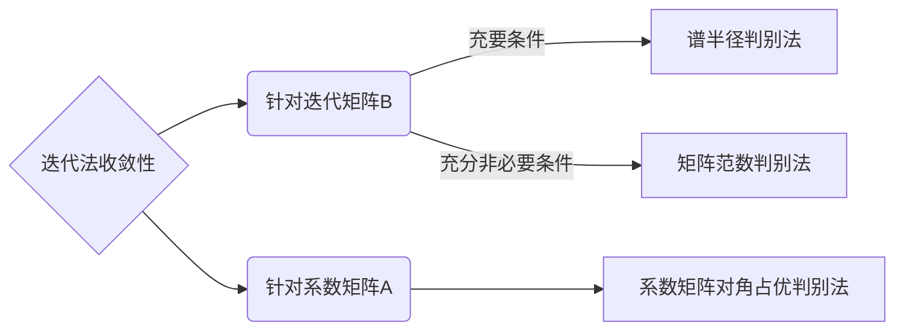

# 迭代法矩阵方程求解

[TOC]

## 迭代法

对于线性方程组 $\boldsymbol{A}\boldsymbol{x}=\boldsymbol{b}$，可通过分裂系数矩阵 $\boldsymbol{A}=\boldsymbol{M}-\boldsymbol{N}$，将求解 $\boldsymbol{A}\boldsymbol{x}=\boldsymbol{b}$ 转化为求解 $\boldsymbol{M}\boldsymbol{x}=\boldsymbol{N}\boldsymbol{x}+\boldsymbol{b}$

$$
\begin{aligned}
    \boxed{\boldsymbol{A}\boldsymbol{x}=\boldsymbol{b}}\Leftrightarrow&\boldsymbol{M}\boldsymbol{x}=\boldsymbol{N}\boldsymbol{x}+\boldsymbol{b}\\
    \Leftrightarrow&\boxed{\boldsymbol{x}=\boldsymbol{B}\boldsymbol{x}+\boldsymbol{f}}\\
    &\boldsymbol{B}=\boldsymbol{M}^{-1}\boldsymbol{N}=\boldsymbol{M}^{-1}(\boldsymbol{M}-\boldsymbol{A})=\boldsymbol{I}-\boldsymbol{M}^{-1}\boldsymbol{A}\\
    &\boldsymbol{f}=\boldsymbol{M}^{-1}\boldsymbol{b}
\end{aligned}
$$

从而可构造一阶定常迭代法

$$
\boxed{\begin{cases}
    \boldsymbol{x}^{(0)}\\
    \boldsymbol{x}^{(k+1)}=\boldsymbol{B}\boldsymbol{x}^{(k)}+\boldsymbol{f}\hspace{3ex}k=0,1,2,\cdots
\end{cases}}
$$

其中，$\boldsymbol{x^{(0)}}$ 为初始向量，$\boldsymbol{B}=\boldsymbol{I}-\boldsymbol{M}^{-1}\boldsymbol{A}$ 为迭代矩阵，$\boldsymbol{M}$ 为分裂矩阵。选取分裂矩阵 $\boldsymbol{M}$ 使得 $\boldsymbol{M}\boldsymbol{x}=\boldsymbol{d}$ 容易求解，选取不同的分裂矩阵 $\boldsymbol{M}$，就得到求解 $\boldsymbol{A}\boldsymbol{x}=\boldsymbol{b}$ 的各种迭代法。

-----

## 迭代法收敛性

**迭代法基本原理** —— 给定线性方程组 $\boldsymbol{A}\boldsymbol{x}=\boldsymbol{b}$ 及一阶定常迭代法 $\boldsymbol{x}^{(k+1)}=\boldsymbol{B}\boldsymbol{x}^{(k)}+\boldsymbol{f}$，对于任意选取初始向量 $\boldsymbol{x}^{(0)}$，迭代式收敛的充要条件是迭代矩阵 $\boldsymbol{B}$ 的谱半径 $\rho(\boldsymbol{B})<1$。

**迭代法收敛的充分条件** —— 对于线性方程组 $\boldsymbol{A}\boldsymbol{x}=\boldsymbol{b}$ 及一阶定常迭代法 $\boldsymbol{x}^{(k+1)}=\boldsymbol{B}\boldsymbol{x}^{(k)}+\boldsymbol{f}$，如果迭代矩阵 $\boldsymbol{B}$ 的某种算子范数 $\left\Vert \boldsymbol{B}\right\Vert=q<1$，那么迭代法收敛。

**对角占优定理** —— 如果 $\boldsymbol{A}=(a_{ij})_{n\times n}$ 为严格对角占优矩阵或 $\boldsymbol{A}$ 为不可约弱对角占优矩阵，则 $\boldsymbol{A}$ 为非奇异矩阵。

### 迭代法误差估计

假设迭代法收敛，即 

$$
\lim_{k\to\infty}\boldsymbol{x}^{(k)}=\boldsymbol{x}^*\hspace{5ex}\boldsymbol{x}^*=\boldsymbol{B}\boldsymbol{x}^*+\boldsymbol{f}
$$

那么

$$
\begin{aligned}
    \left\Vert \boldsymbol{x}^*-\boldsymbol{x}^{(k)}\right\Vert&\leqslant q^k\left\Vert \boldsymbol{x}^*-\boldsymbol{x}^{(0)}\right\Vert\\
    \left\Vert \boldsymbol{x}^*-\boldsymbol{x}^{(k)}\right\Vert&\leqslant \frac{q}{1-q}\left\Vert \boldsymbol{x}^{(k)}-\boldsymbol{x}^{(k-1)}\right\Vert &(后验误差估计)\\
    \left\Vert \boldsymbol{x}^*-\boldsymbol{x}^{(k)}\right\Vert&\leqslant \frac{q^k}{1-q}\left\Vert \boldsymbol{x}^{(1)}-\boldsymbol{x}^{(0)}\right\Vert &(先验误差估计)
\end{aligned}
$$

-----

$$
\begin{aligned}
    \boldsymbol{A}&=\begin{bmatrix}
        a_{11} & & &\\
        &a_{22} & &\\
        & &\ddots &\\
        & & &a_{nn}
    \end{bmatrix}-\begin{bmatrix}
        0 & & & &\\
        -a_{21} &0 & & &\\
        \vdots &\vdots &\ddots & &\\
        -a_{n-1,1} &-a_{n-1,2} &\cdots &0 &\\
        -a_{n1} &-a_{n2} &\cdots &-a_{n,n-1} &0 
    \end{bmatrix}-\begin{bmatrix}
        0 &-a_{12} &\cdots &-a_{1,n-1} &-a_{1n}\\
        &0 &\cdots &-a_{2,n-1} &-a_{2n}\\
        & &\ddots &\vdots &\vdots\\
        & &  &0 &-a_{n-1,n}\\
        & & & &0
    \end{bmatrix}\\
    &=\boldsymbol{D}-\boldsymbol{L}-\boldsymbol{U}
\end{aligned}
$$

-----

## Jacobi 迭代法

选取分裂矩阵 $\boldsymbol{M}=\boldsymbol{D}$ 为系数矩阵 $\boldsymbol{A}$ 的对角元素部分，根据 $\boldsymbol{x}=\boldsymbol{B}\boldsymbol{x}+\boldsymbol{f}$ 得到求解 $\boldsymbol{A}\boldsymbol{x}=\boldsymbol{b}$ 的 **Jacobi 迭代法**

$$
\boxed{\begin{aligned}
    &\begin{cases}
        \boldsymbol{x}^{(0)}\\
        \boldsymbol{x}^{(k+1)}=\boldsymbol{J}\boldsymbol{x}^{(k)}+\boldsymbol{f}\hspace{5ex}k=0,1,2,\cdots
    \end{cases}\\
    &\boldsymbol{J}=\boldsymbol{I}-\boldsymbol{D}^{-1}\boldsymbol{A}=\boldsymbol{D}^{-1}(\boldsymbol{L}+\boldsymbol{U})\\
    &\boldsymbol{f}=\boldsymbol{D}^{-1}\boldsymbol{b}
\end{aligned}}
$$

根据 Jacobi 迭代法公式

$$
\begin{aligned}
    &\boldsymbol{D}\boldsymbol{x}^{(k+1)}=(\boldsymbol{L}+\boldsymbol{U})\boldsymbol{x}^{(k)}+\boldsymbol{b}\\
    \Leftrightarrow&a_{ii}x_i^{(k+1)}=-\sum_{j=1}^{i-1}a_{ij}x_j^{(k)}-\sum_{j=i+1}^na_{ij}x_j^{(k)}+b_i\hspace{5ex}i=1,2,\cdots,n
\end{aligned}
$$

得到 Jacobi 迭代法的分量计算公式

$$
\boxed{\begin{aligned}
    &\boldsymbol{x}^{(0)}=\left(x_1^{(0)},x_2^{(0)},\cdots,x_n^{(0)}\right)^{\mathrm{T}}\\
    &x_i^{(k+1)}=\left(b_i-\sum_{j=1,j\neq i}^n a_{ij}x_j^{(k)}\right)/a_{ii}\hspace{5ex}i=1,2,\cdots,n
\end{aligned}}
$$

**设 $\boldsymbol{A}\boldsymbol{x}=\boldsymbol{b}$，其中 $\boldsymbol{A}$ 为非奇异矩阵，且对角矩阵 $\boldsymbol{D}$ 也非奇异，则解线性方程组的 Jacobi 迭代法收敛的充要条件是 $\rho(\boldsymbol{J})<1$。**

**设 $\boldsymbol{A}\boldsymbol{x}=\boldsymbol{b}$，如果 $\boldsymbol{A}$ 为严格对角占优矩阵（或 $\boldsymbol{A}$ 为弱对角占优不可约矩阵），则解 $\boldsymbol{A}\boldsymbol{x}=\boldsymbol{b}$ 的 Jacobi 迭代法收敛。**

**若线性方程组系数矩阵 $\boldsymbol{A}$ 对称正定，那么解线性方程组 $\boldsymbol{A}\boldsymbol{x}=\boldsymbol{b}$ 的 Jacobi 迭代法收敛的充分必要条件是 $\boldsymbol{A}$ 及 $2\boldsymbol{D}-\boldsymbol{A}$ 均为正定矩阵。**

-----

## Gauss-Seidel 迭代法

选取分裂矩阵 $\boldsymbol{M}=\boldsymbol{D}-\boldsymbol{L}$ 为系数矩阵 $\boldsymbol{A}$ 的下三角部分，根据 $\boldsymbol{x}=\boldsymbol{B}\boldsymbol{x}+\boldsymbol{f}$ 得到求解 $\boldsymbol{A}\boldsymbol{x}=\boldsymbol{b}$ 的 **Gauss-Seidel 迭代法**

$$
\boxed{\begin{aligned}
    &\begin{cases}
        \boldsymbol{x}^{(0)}\\
        \boldsymbol{x}^{(k+1)}=\boldsymbol{G}\boldsymbol{x}^{(k)}+\boldsymbol{f}\hspace{5ex}k=0,1,2,\cdots
    \end{cases}\\
    &\boldsymbol{G}=\boldsymbol{I}-(\boldsymbol{D}-\boldsymbol{L})^{-1}\boldsymbol{A}=(\boldsymbol{D}-\boldsymbol{L})^{-1}\boldsymbol{U}\\
    &\boldsymbol{f}=(\boldsymbol{D}-\boldsymbol{L})^{-1}\boldsymbol{b}
\end{aligned}}
$$

根据 Gauss-Seidel 迭代法公式

$$
\begin{aligned}
    &(\boldsymbol{D}-\boldsymbol{L})\boldsymbol{x}^{(k+1)}=\boldsymbol{U}\boldsymbol{x}^{(k)}+\boldsymbol{b}\\
    \Leftrightarrow&\boldsymbol{D}\boldsymbol{x}^{(k+1)}=\boldsymbol{L}\boldsymbol{x}^{(k+1)}+\boldsymbol{U}\boldsymbol{x}^{(k)}+\boldsymbol{b}\\
    \Leftrightarrow&a_{ii}x_i^{(k+1)}=b_i-\sum_{j=1}^{i-1}a_{ij}x_j^{(k+1)}-\sum_{j=i+1}^na_{ij}x_j^{(k)}\hspace{5ex}i=1,2,\cdots,n
\end{aligned}
$$

得到 Gauss-Seidel 迭代法的分量计算公式

$$
\boxed{\begin{aligned}
    &\boldsymbol{x}^{(0)}=\left(x_1^{(0)},x_2^{(0)},\cdots,x_n^{(0)}\right)^{\mathrm{T}}\\
    &x_i^{(k+1)}=\left(b_i-\sum_{j=1}^{i-1}a_{ij}x_j^{(k+1)}-\sum_{j=i+1}^na_{ij}x_j^{(k)}\right)/a_{ii}\hspace{5ex}i=1,2,\cdots,n
\end{aligned}}
$$

*Jacobi 迭代法不使用变量的最新信息计算 $x_i^{(k+1)}$，而由 Gauss-Seidel 迭代法的分量计算公式可知，计算 $\boldsymbol{x}^{(k+1)}$ 的第 $i$ 个分量 $x_i^{(k+1)}$ 时，利用了已经计算出的最新分量 $x_j^{(k+1)}$（$j=1,2,\cdots,i-1$）。因此，在迭代计算的过程中，Jacobi 迭代法需要两个数组存储向量，而 Gauss-Seidel 迭代法仅需要一个数组存储向量，Gauss-Seidel 迭代法可看作 Jacobi 迭代法的一种改进。*

**设 $\boldsymbol{A}\boldsymbol{x}=\boldsymbol{b}$，其中 $\boldsymbol{A}$ 为非奇异矩阵，且对角矩阵 $\boldsymbol{D}$ 也非奇异，则解线性方程组的 Gauss-Seidel 迭代法收敛的充要条件是 $\rho(\boldsymbol{G})<1$。**

**设 $\boldsymbol{A}\boldsymbol{x}=\boldsymbol{b}$，如果 $\boldsymbol{A}$ 为严格对角占优矩阵（或 $\boldsymbol{A}$ 为弱对角占优不可约矩阵），则解 $\boldsymbol{A}\boldsymbol{x}=\boldsymbol{b}$ 的 Gauss-Seidel 迭代法收敛。**

**若线性方程组系数矩阵 $\boldsymbol{A}$ 对称正定，那么解线性方程组 $\boldsymbol{A}\boldsymbol{x}=\boldsymbol{b}$ 的 Gauss-Seidel 迭代法收敛的充分条件是 $\boldsymbol{A}$ 正定。**

-----

## SOR 迭代法

选取分裂矩阵 $\boldsymbol{M}=(\boldsymbol{D}-\omega\boldsymbol{L})/\omega$ 为带参数的下三角矩阵（$\omega>0$ 为可选择的松弛因子），根据 $\boldsymbol{x}=\boldsymbol{B}\boldsymbol{x}+\boldsymbol{f}$ 得到求解 $\boldsymbol{A}\boldsymbol{x}=\boldsymbol{b}$ 的**逐次超松弛迭代法（successsive over relaxtion method，简称 SOR 方法）**

$$
\boxed{\begin{aligned}
    &\begin{cases}
        \boldsymbol{x}^{(0)}\\
        \boldsymbol{x}^{(k+1)}=\boldsymbol{L}_\omega\boldsymbol{x}^{(k)}+\boldsymbol{f}\hspace{5ex}k=0,1,2,\cdots
    \end{cases}\\
    &\boldsymbol{L}_\omega=\boldsymbol{I}-\omega(\boldsymbol{D}-\omega\boldsymbol{L})^{-1}\boldsymbol{A}=(\boldsymbol{D}-\omega\boldsymbol{L})^{-1}[(1-\omega)\boldsymbol{D}+\omega\boldsymbol{U}]\\
    &\boldsymbol{f}=\omega(\boldsymbol{D}-\omega\boldsymbol{L})^{-1}\boldsymbol{b}
\end{aligned}}
$$

根据 SOR 迭代法公式

$$
\begin{aligned}
    &(\boldsymbol{D}-\omega\boldsymbol{L})\boldsymbol{x}^{(k+1)}=[(1-\omega)\boldsymbol{D}+\omega\boldsymbol{U}]\boldsymbol{x}^{(k)}+\omega\boldsymbol{b}\\
    \Leftrightarrow&\boldsymbol{D}\boldsymbol{x}^{(k+1)}=\boldsymbol{D}\boldsymbol{x}^{(k)}+\omega\left(\boldsymbol{b}+\boldsymbol{L}\boldsymbol{x}^{(k+1)}+\boldsymbol{U}\boldsymbol{x}^{(k)}-\boldsymbol{D}\boldsymbol{x}^{(k)}\right)
\end{aligned}
$$

得到 SOR 迭代法的分量计算公式

$$
\boxed{\begin{aligned}
    &\boldsymbol{x}^{(0)}=\left(x_1^{(0)},x_2^{(0)},\cdots,x_n^{(0)}\right)^{\mathrm{T}}\\
    &x_i^{(k+1)}=x_i^{(k)}+\omega\left(b_i-\sum_{j=1}^{i-1}a_{ij}x_j^{(k+1)}-\sum_{j=i}^na_{ij}x_j^{(k)}\right)/a_{ii}\hspace{5ex}i=1,2,\cdots,n
\end{aligned}}
$$

*显然，当 $\omega=1$ 时，SOR 迭代法即为 Gauss-Seidel 迭代法。因此，SOR 迭代法是 Gauss-Seidel 迭代法的一种修正*

$$
\begin{aligned}
    x_i^{(k+1)}&=x_i^{(k)}+\omega\left(b_i-\sum_{j=1}^{i-1}a_{ij}x_j^{(k+1)}-\sum_{j=i}^na_{ij}x_j^{(k)}\right)/a_{ii}\\
    &=(1-\omega)x_i^{(k)}+\omega\left(b_i-\sum_{j=1}^{i-1}a_{ij}x_j^{(k+1)}-\sum_{j=i+1}^na_{ij}x_j^{(k)}\right)/a_{ii}\\
    &=(1-\omega)x_i^{(k)}+\omega\widetilde{x}_i^{(k+1)}
\end{aligned}
$$

**SOR 迭代法收敛的必要条件 —— 设解线性方程组 $\boldsymbol{A}\boldsymbol{x}=\boldsymbol{b}$ 的 SOR 迭代法收敛，则 $0<\omega<2$。**

**设 $\boldsymbol{A}\boldsymbol{x}=\boldsymbol{b}$，如果 $\boldsymbol{A}$ 为严格对角占优矩阵（或 $\boldsymbol{A}$ 为弱对角占优不可约矩阵），且 $0<\omega\leqslant1$，则解 $\boldsymbol{A}\boldsymbol{x}=\boldsymbol{b}$ 的 SOR 迭代法收敛。**

**设 $\boldsymbol{A}\boldsymbol{x}=\boldsymbol{b}$，若 $\boldsymbol{A}$ 为对称正定矩阵，且 $0<\omega<2$，则解 $\boldsymbol{A}\boldsymbol{x}=\boldsymbol{b}$ 的 SOR 迭代法收敛。**

-----

**与线性方程组等价的变分问题** —— 设 $\boldsymbol{A}$ 对称正定，则 $\boldsymbol{x}^*$ 为线性方程组 $\boldsymbol{A}\boldsymbol{x}=\boldsymbol{b}$ 解的充分必要条件是

$$
\begin{aligned}
    \varphi(\boldsymbol{x}^*)&=\min_{x\in \mathbb{R}^n}\varphi(\boldsymbol{x})\\
    \varphi(\boldsymbol{x})&=\frac{1}{2}(\boldsymbol{A}\boldsymbol{x},\boldsymbol{x})-(\boldsymbol{b},\boldsymbol{x})
\end{aligned}
$$

可根据与线性方程组 $\boldsymbol{A}\boldsymbol{x}=\boldsymbol{b}$ 等价的变分问题 $\min_{\boldsymbol{x}\in\mathbb{R}^n}\varphi(\boldsymbol{x})$ 构造迭代公式

$$
\begin{aligned}
    \boldsymbol{x}^{(k+1)}=\boldsymbol{x}^{(k)}+\alpha_k\boldsymbol{p}^{(k)}
\end{aligned}
$$

选择 $\varphi(\boldsymbol{x})$ 在点 $\boldsymbol{x}^{(k)}$ 下降最快的方向作为 $\boldsymbol{p}^{(k)}$

$$
\boldsymbol{p}^{(k)}=-\nabla\varphi\left(\boldsymbol{x}^{(k)}\right)=-\left(\boldsymbol{A}\boldsymbol{x}^{(k)}-\boldsymbol{b}\right)=\boldsymbol{r}^{(k)}
$$

其中，$\boldsymbol{r}^{(k)}=\boldsymbol{b}-\boldsymbol{A}\boldsymbol{x}^{(k)}$ 为剩余向量。$\alpha_k$ 的选择使 $\varphi\left(\boldsymbol{x}^{(k+1)}\right)=\min_{\alpha\in\mathrm{R}}\varphi\left(\boldsymbol{x}^{(k)}+\alpha\boldsymbol{p}^{(k)}\right)$

$$
\begin{aligned}
    &\frac{\mathrm{d}\varphi\left(\boldsymbol{x}^{(k)}+\alpha\boldsymbol{p}^{(k)}\right)}{\mathrm{d}\alpha}=\left(\boldsymbol{A}\boldsymbol{x}^{(k)}-\boldsymbol{b},\boldsymbol{p}^{(k)}\right)+\alpha\left(\boldsymbol{A}\boldsymbol{p}^{(k)},\boldsymbol{p}^{(k)}\right)=0\\
    \Rightarrow&\alpha_k=-\frac{\left(\boldsymbol{A}\boldsymbol{x}^{(k)}-\boldsymbol{b},\boldsymbol{p}^{(k)}\right)}{\left(\boldsymbol{A}\boldsymbol{p}^{(k)},\boldsymbol{p}^{(k)}\right)}
\end{aligned}
$$

因此，解线性方程组的最速下降法

$$
\boxed{\begin{aligned}
    &\boldsymbol{x}^{(k+1)}=\boldsymbol{x}^{(k)}+\alpha_k\boldsymbol{r}^{(k)}\hspace{5ex}k=0,1,2,\cdots\\
    &\alpha_k=-\frac{\left(\boldsymbol{A}\boldsymbol{x}^{(k)}-\boldsymbol{b},\boldsymbol{p}^{(k)}\right)}{\left(\boldsymbol{A}\boldsymbol{p}^{(k)},\boldsymbol{p}^{(k)}\right)}
\end{aligned}}
$$

最速下降法的误差估计

$$
\begin{aligned}
    &\left\Vert\boldsymbol{x}^{(k)}-\boldsymbol{x}^*\right\Vert_{\boldsymbol{A}}\leqslant\left(\frac{\lambda_1-\lambda_n}{\lambda_1+\lambda_n}\right)^k\left\Vert\boldsymbol{x}^{(0)}-\boldsymbol{x}^*\right\Vert_{\boldsymbol{A}}\\
    &\lambda_1\geqslant\cdots\geqslant\lambda_n\hspace{5ex}\Vert\boldsymbol{u}\Vert_{\boldsymbol{A}}=(\boldsymbol{A}\boldsymbol{x},\boldsymbol{x})^{1/2}
\end{aligned}
$$

-----

## CG 迭代法

最速下降法的两个相邻的搜索方向是正交的

$$
\left(\boldsymbol{r}^{(k+1)},\boldsymbol{r}^{(k)}\right)=\left(\boldsymbol{b}-\boldsymbol{A}\left(\boldsymbol{x}^{(k)}+\alpha_k\boldsymbol{r}^{(k)}\right),\boldsymbol{r}^{(k)}\right)=\left(\boldsymbol{r}^{(k)},\boldsymbol{r}^{(k)}\right)-\alpha_k\left(\boldsymbol{A}\boldsymbol{r}^{(k)},\boldsymbol{r}^{(k)}\right)=0
$$

若搜索方向 $\boldsymbol{p}^{(0)},\boldsymbol{p}^{(1)},\boldsymbol{p}^{(2)},\cdots$ 并不互相正交，而是 $\boldsymbol{A}$-正交 $\left(\boldsymbol{A}\boldsymbol{p}^{(i)},\boldsymbol{p}^{(j)}\right)=0$，由此得到的迭代算法称为共轭梯度迭代法（conjugate gradient method，CG 方法）。

在每次迭代确定 $\boldsymbol{p}^{(k)}$ 和 $\alpha$ 使

$$
\begin{aligned}
    &\begin{dcases}
        \varphi\left(\boldsymbol{x}^{(k+1)}\right)=\min_{\alpha}\varphi\left(\boldsymbol{x}^{(k)}+\alpha\boldsymbol{p}^{(k)}\right)\\
        \varphi\left(\boldsymbol{x}^{(k+1)}\right)=\min_{\boldsymbol{x}\in\mathrm{span}\left\{\boldsymbol{p}^{(0)},\boldsymbol{p}^{(1)},\cdots,\boldsymbol{p}^{(k)}\right\}}\varphi(\boldsymbol{x})
    \end{dcases}\\
    &\boldsymbol{x}=\boldsymbol{y}+\alpha\boldsymbol{p}^{(k)}\\
    &\boldsymbol{x}\in\mathrm{span}\left\{\boldsymbol{p}^{(0)},\boldsymbol{p}^{(1)},\boldsymbol{p}^{(2)},\cdots,\boldsymbol{p}^{(k)}\right\}&\hspace{5ex}\boldsymbol{y}\in\mathrm{span}\left\{\boldsymbol{p}^{(0)},\boldsymbol{p}^{(1)},\boldsymbol{p}^{(2)},\cdots,\boldsymbol{p}^{(k-1)}\right\}
\end{aligned}
$$

在 $\boldsymbol{y}$ 已确定的情况下，选 $\boldsymbol{p}^{(k)}$ 使 $\boldsymbol{x}$ 在整个空间 $\mathrm{span}\left\{\boldsymbol{p}^{(0)},\boldsymbol{p}^{(1)},\boldsymbol{p}^{(2)},\cdots,\boldsymbol{p}^{(k)}\right\}$ 中 $\varphi(\boldsymbol{x})$ 最小

$$
\begin{aligned}
    &\varphi(\boldsymbol{x})=\varphi\left(\boldsymbol{y}+\alpha\boldsymbol{p}^{(k)}\right)=\varphi(\boldsymbol{y})+\alpha\left(\boldsymbol{A}\boldsymbol{y},\boldsymbol{p}^{(k)}\right)+\frac{\alpha}{2}\left(\boldsymbol{A}\boldsymbol{p}^{(k)},\boldsymbol{p}^{(k)}\right)\\
\end{aligned}
$$

对 $\alpha$ 及 $\boldsymbol{y}$ 分别求极小要求

$$
\begin{aligned}
    &\left(\boldsymbol{A}\boldsymbol{y},\boldsymbol{p}^{(k)}\right)=0\hspace{5ex}\forall\boldsymbol{y}\in\mathrm{span}\left\{\boldsymbol{p}^{(0)},\boldsymbol{p}^{(1)},\boldsymbol{p}^{(2)},\cdots,\boldsymbol{p}^{(k-1)}\right\}\\
    \Rightarrow&\left(\boldsymbol{A}\boldsymbol{p}^{(j)},\boldsymbol{p}^{(k)}\right)=0\hspace{5ex}j=0,1,2,\cdots,k-1
\end{aligned}
$$

因此，CG 迭代法的搜索方向 $\left\{\boldsymbol{p}^{(0)},\boldsymbol{p}^{(1)},\cdots\right\}$ 是 $\boldsymbol{A}$-共轭的（$\boldsymbol{A}$-正交的）。令 $\boldsymbol{p}^{(0)}=\boldsymbol{r}^{(0)}=\boldsymbol{b}-\boldsymbol{A}\boldsymbol{x}^{(0)}$，搜索方向 $\boldsymbol{p}^{(k)}$ 选为 $\boldsymbol{p}^{(0)},\boldsymbol{p}^{(1)},\boldsymbol{p}^{(2)},\cdots,\boldsymbol{p}^{(k-1)}$ 的 $\boldsymbol{A}$-正交向量

$$
\begin{dcases}
    \boldsymbol{p}^{(k)}=\boldsymbol{r}^{(k)}+\beta_{k-1}\boldsymbol{p}^{(k-1)}\\
    \left(\boldsymbol{p}^{(k)},\boldsymbol{A}\boldsymbol{p}^{(k-1)}\right)=0
\end{dcases}\Rightarrow\beta_{k-1}=-\frac{\left(\boldsymbol{r}^{(k)},\boldsymbol{A}\boldsymbol{p}^{(k-1)}\right)}{\left(\boldsymbol{p}^{(k-1)},\boldsymbol{A}\boldsymbol{p}^{(k-1)}\right)}
$$

对 $\alpha_k$ 进行简化

$$
\begin{aligned}
    &\boldsymbol{r}^{(k+1)}=\boldsymbol{b}-\boldsymbol{A}\boldsymbol{x}^{(k+1)}=\boldsymbol{r}^{(k)}-\alpha_k\boldsymbol{A}\boldsymbol{p}^{(k)}\\
    \Rightarrow&\left(\boldsymbol{r}^{(k+1)},\boldsymbol{p}^{(k)}\right)=\left(\boldsymbol{r}^{(k)},\boldsymbol{p}^{(k)}\right)-\alpha_k\left(\boldsymbol{A}\boldsymbol{p}^{(k)},\boldsymbol{p}^{(k)}\right)=0\\
    \Rightarrow&\left(\boldsymbol{r}^{(k)},\boldsymbol{p}^{(k)}\right)=\left(\boldsymbol{r}^{(k)},\boldsymbol{r}^{(k)}+\beta_{k-1}\boldsymbol{p}^{(k-1)}\right)=\left(\boldsymbol{r}^{(k)},\boldsymbol{p}^{(k)}\right)\\
    \Rightarrow&\alpha_k=\frac{\left(\boldsymbol{r}^{(k)},\boldsymbol{r}^{(k)}\right)}{\left(\boldsymbol{p}^{(k)},\boldsymbol{A}\boldsymbol{p}^{(k)}\right)}
\end{aligned}
$$

因此，CG 迭代法的计算公式

$$
\boxed{\begin{aligned}
    &\forall\boldsymbol{x}^{(0)}\in\mathbb{R}^n\Rightarrow\boldsymbol{p}^{(0)}=\boldsymbol{r}^{(0)}=\boldsymbol{b}-\boldsymbol{A}\boldsymbol{x}^{(0)}\\\\
    &\begin{dcases}
    \boldsymbol{x}^{(k+1)}=\boldsymbol{x}^{(k)}+\alpha_k\boldsymbol{p}^{(k)}\hspace{5ex}k=0,1,2,\cdots\\
    \alpha_k=\frac{\left(\boldsymbol{r}^{(k)},\boldsymbol{r}^{(k)}\right)}{\left(\boldsymbol{p}^{(k)},\boldsymbol{A}\boldsymbol{p}^{(k)}\right)}\\
    \boldsymbol{p}^{(k)}=\boldsymbol{r}^{(k)}+\beta_{k-1}\boldsymbol{p}^{(k-1)}\\
    \boldsymbol{r}^{(k)}=\boldsymbol{r}^{(k-1)}-\alpha_k\boldsymbol{A}\boldsymbol{p}^{(k-1)}\hspace{5ex}\beta_{k-1}=-\frac{\left(\boldsymbol{r}^{(k)},\boldsymbol{A}\boldsymbol{p}^{(k-1)}\right)}{\left(\boldsymbol{p}^{(k-1)},\boldsymbol{A}\boldsymbol{p}^{(k-1)}\right)}
    \end{dcases}
\end{aligned}}
$$

由 CG 迭代法得到的 $\left\{\boldsymbol{p}^{(k)}\right\}$ 为一个 $\boldsymbol{A}$-共轭向量组，$\left\{\boldsymbol{r}^{(k)}\right\}$ 构成 $\mathbb{R}^n$ 中的正交向量组

$$
\begin{aligned}
    \left(\boldsymbol{A}\boldsymbol{p}^{(i)},\boldsymbol{p}^{(j)}\right)&=0\hspace{5ex}i\neq j\\
    \left(\boldsymbol{r}^{(i)},\boldsymbol{r}^{(j)}\right)&=0\hspace{5ex}i\neq j
\end{aligned}
$$

**因此，在 $\boldsymbol{r}^{(0)},\boldsymbol{r}^{(1)},\cdots,\boldsymbol{r}^{(n)}$ 中至少有一个零向量。若 $\boldsymbol{r}^{(k)}=0$，则 $\boldsymbol{x}^{(k)}=\boldsymbol{x}^*$，所以用 CG 迭代法求解 $n$ 维线性方程组，理论上最多 $n$ 步便可求得精确解，从这个意义上讲 CG 迭代法是一种直接法。但在舍入误差存在的情况下，很难保证 $\left\{\boldsymbol{r}^{(k)}\right\}$ 的正交性，此外当 $n$ 很大时，实际计算步数 $k\ll n$，即可达到精度要求而不必计算 $n$ 步。总这个意义上讲，它是一个迭代法，存在收敛性的问题，给出 CG 迭代法的误差估计**

$$
\begin{aligned}
    &\Vert\boldsymbol{x}^{(k)}-\boldsymbol{x}^*\Vert_{\boldsymbol{A}}\leqslant2\left(\frac{\sqrt{K}-1}{\sqrt{K}+1}\right)^k\Vert\boldsymbol{x}^{(0)}-\boldsymbol{x}^*\Vert_{\boldsymbol{A}}\\
    &\Vert\boldsymbol{x}\Vert_{\boldsymbol{A}}=\left(\boldsymbol{x},\boldsymbol{A}\boldsymbol{x}\right)^{1/2}\hspace{5ex}K=\mathrm{cond}(\boldsymbol{A})_2
\end{aligned}
$$