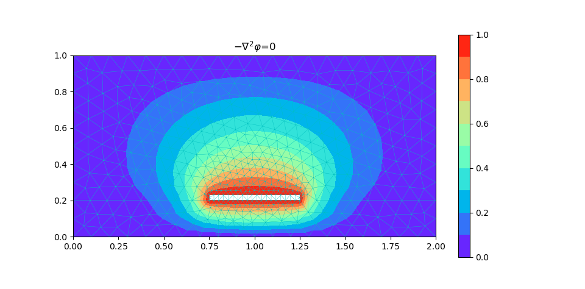
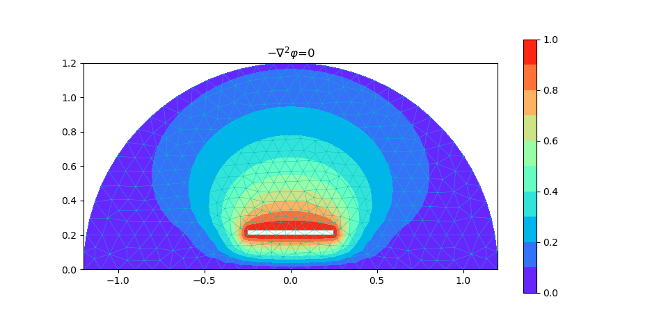

# 微带线的计算

[TOC]

## 程序说明

* microstrip.mph 为 COMSOL 计算的屏蔽微带线模型
* microstrip.m 为 PDEtool 计算的屏蔽微带线模型
* shield 路径下的 C 程序计算了屏蔽微带线模型
* open 路径下的 C 程序计算了开域微带线模型
* no media 路径下的 C 程序计算了无介质板的微带线模型

## 计算结果

**屏蔽微带线模型**

    
    

**开域微带线计算模型**

    

## interesting

当模型中含有不同介电媒质时，在这两种媒质的界面上，电势应满足连续性条件

$$
\begin{aligned}
    \hat{n}\times\vec{E}^+=\hat{n}\times\vec{E}^-&\Rightarrow\varphi^+=\varphi^-\\
    \hat{n}\cdot\vec{D}^+=\hat{n}\cdot\vec{D}^-&\Rightarrow\varepsilon_r^+\frac{\partial \varphi^+}{\partial n}=\varepsilon_r^-\frac{\partial \varphi^-}{\partial n}
\end{aligned}
$$

但实际有限元的计算过程中并没有刻意去处理边界条件，这让人很奇怪。其实关于介电媒质的信息早就包含在刚度矩阵中

$$
\begin{aligned}
    \frac{\partial F^e}{\partial \boldsymbol{\varphi}^e}&=\boldsymbol{K}^e\boldsymbol{\varphi}^e-\boldsymbol{b}^e=\boldsymbol{0}\\
    K_{ij}^e&=\iint_{\Omega^e}\left(\varepsilon_r\frac{\partial N_i^e}{\partial x}\frac{\partial N_j^e}{\partial x}+\varepsilon_r\frac{\partial N_i^e}{\partial y}\frac{\partial N_j^e}{\partial y}+\beta N_i^eN_j^e\right)\mathrm{d}x\mathrm{d}y\\
    &\approx\frac{1}{4\Delta^e}(\varepsilon_r^eb_i^eb_j^e+\varepsilon_r^ec_i^ec_j^e)+\frac{\Delta^e}{12}\beta^e(1+\delta_{ij})\\
    b_i^e&=\iint_{\Omega^e}fN_i^e\mathrm{d}x\mathrm{d}y\approx\frac{\Delta^e}{3}f^e
\end{aligned}
$$

在《有限元方法及其应用》的前言有这样一段话很好地解释了这一点

>有限元方法摒弃了刻画自然规律中局部的、瞬时的数学描述而以大范围的、全过程的数学分析作为自己的出发点。局部和整体,瞬时和全过程,只是以两种不同的角度来描述自然现象。一个过程,既可以被微分方程所描述,又服从相应的变分原理,方法虽然不同,但却从不同的侧面来反映同一自然规律。